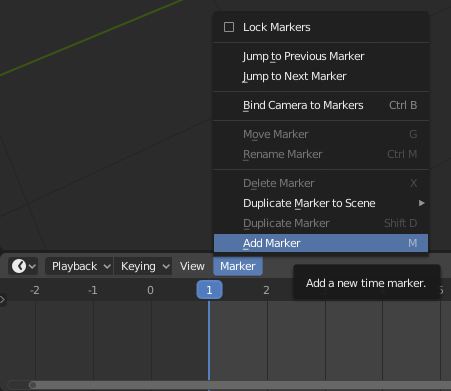
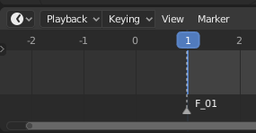
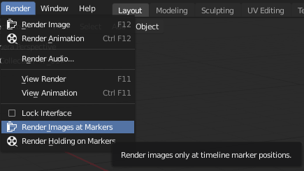
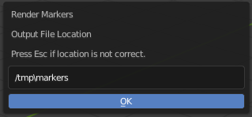
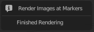
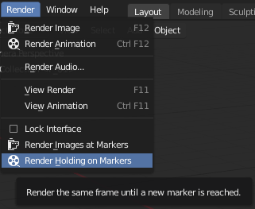

# Render Markers Blender Add-on

This add-on appends two render options to the Render menu of Blender. The first will allow a user to render multiple single frames in one pass by only rendering frames that have markers. The second option will render frames in an animatic style format by rendering the same frame until a new marker is reached. This is somtimes referred to as 'stepped' motion.

## Features
* Render only single frames that have markers
* Render the same frame until a new marker is reached

## Requirements
* Blender 2.8 or higher

## Restrictions
The Render Markers add-on will not render movie file formats.

## Donations
This add-on is free to use. If you find it useful, make a purchase of any amount on [Gumroad](https://gum.co/wrIGs).

## Installation
In Blender's Edit menu, select "Preferences..." and then choose the Add-ons tab. Press the "Install..." button and select this zip file.

## How to use
1. Add markers to the timeline
2. Choose render method
    - Render Images at Markers
    - Render Holding on Markers

### Add markers to the timeline
This addon will not work unless there are markers in the timeline. Markers can be created anywhere on the timeline. Setting a marker is like setting a keyframe. Move the timeline in the timeline to where a marker is to be set. In the timeline Marker menu, select "Add Marker".

A new marker will appear below the timeline. Its name will correspond to the frame it was set on. Frame 1 will end up with the name F_01.

### Render Images at Markers
From the Render menu, select "Render Images at Markers".

A new window will pop up showing the output location. If it is not correct, press the Escape key on the keyboard. Change the scene output properties and then go back to the Render menu and select "Render Images at Markers".

After pressing OK, Blender will seem to be frozen or like it has crashed. The window showing the output file location will stay open until the redner is done. Navigate to the output folder to see the images being saved.
  
When the render process is done, the output file location window will disappear and a new window may open to report that the render has finished. Moving the mouse away from the window will make it disappear. 

### Render Holding on Markers
This option is similar to the previous, but it will keep rendering the same frame until a new marker is reached in the timeline. If a marker is set on frame 1 and the next marker is on frame 5, the image of frame 1 will appear on frames 1 - 4. Frame 5 will get a new rendered image. The result is that playback of the frames will show a 'stepped' motion.

